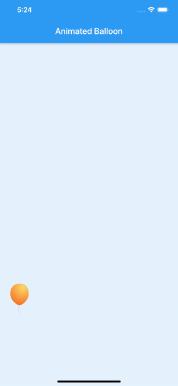

# Floating Balloon Animation
## Video Tutorial
[YouTube Video](https://youtu.be/b89oQwr3GBs)
[Blog](https://jedipixels.dev/flutter-animationcontroller-floating-balloon-animation)


## Using AnimationController to create custom and staggered animations
In this project, you are going to take a look at:
- How to use the ```AnimationController``` to create custom animations
- How to use the ```AnimationController``` to control staggered animations

## AnimationController
The `AnimationController` class gives you increased flexibility in animation. The animation can be played forward or reverse, and you can stop it.

The `AnimationController` class produces linear values for a giving `duration`, and it tries to display a new frame at around 60 frames per second. The `AnimationController` class needs a Ticker-Provider class by passing the `vsync` argument in the constructor. The `vsync` prevents off-screen animations from consuming unnecessary resources. 

    AnimationController(duration: Duration(seconds: 4), vsync: this)

If the animation needs only one `AnimationController`, use `SingleTickerProviderStateMixin`. If the animation needs multiple `AnimationControllers`, use `TickerProviderStateMixin`. The Ticker class is driven by the `ScheduleBinding.scheduleFrameCallback` reporting once per animation frame. It is trying to sync the animation to be as smooth as possible.

```class _AnimatedBalloonWidgetState extends State<AnimatedBalloonWidget> with SingleTickerProviderStateMixin {}```

## AnimationController Steps
The `AnimationController` class at first can seem complex to use because of the different classes needed. The following are the basic steps that you take to create a custom animation or multiple animations running at the same time.


1. Add `AnimationController`.
2. Add `Animation`.
3. Initiate `AnimationController` with `Duration` (milliseconds, seconds, and so on).
4. Initiate `Animation` with `Tween` with `begin` and `end` values and chain the animate method with a `CurvedAnimation` (for this example).
5. Use the `AnimatedBuilder` with `Animation` using a `Container` with a balloon to start `Animation` by calling the `AnimationController.forward()` and `.reverse()` to run the animation backward. The `AnimatedBuilder` widget is used to create a widget that performs a reusable animation.

As you can see, once you break down the steps, it becomes more manageable and less complicated.


## Using Staggered Animations 

A staggered animation triggers visual changes in sequential order. The animation changes can occur one after the other; they can have gaps without animations and overlap each other. One `AnimationController` class controls multiple `Animation` objects that specify the animation in a timeline (`Interval`).

    Animation<double> _animationFloatUp;
    Animation<double> _animationGrowSize;

 Now you’ll walk through an example of using one `AnimationController` class and the `Interval()` `curve` property to start different animations at different times. As noted in the preceding section, a staggered animation uses `Interval()` to begin and end animations sequentially or to overlap one another.

    Interval(0.0, 1.0, curve: Curves.fastOutSlowIn)
    Interval(0.0, 0.75, curve: Curves.elasticInOut)

## How It Works

Declaring `SingleTickerProviderStateMixin` to the `AnimatedBalloonWidget` widget class allows you to set the `AnimationController` `vsync` argument. The `SingleTickerProviderStateMixin` allows only one `AnimationController`. You added `AnimationController` and declared the `_controller` variable to animate both the floating upward or downward and the inflation or deflation of the balloon.

You declared the `_animationFloatUp` variable to hold the value from the `Tween` animation to show the balloon either floating upward or downward by setting the `top` margin of the `Container` widget. You also declared the `_animationGrowSize` variable to hold the value from the `Tween` animation to show the balloon either inflating or deflating by setting the `width` value of the `Container` widget.

The `AnimatedBuilder` constructor takes `animation`, `builder`, and `child` arguments. Next, you passed the `_animationFloatUp` animation to the `AnimatedBuilder` constructor. The `AnimatedBuilder` `builder` argument returns a `Container` widget with the `child` as an `Image` wrapped in a `GestureDetector` widget.

You used one `AnimationController` class with multiple `Animation` classes to create staggered animations.

## AnimationController 
This creates custom animations by using `TickerProviderStateMixin`, `SingleTickerProviderStateMixin`, `AnimationController`, `Animation`, `Tween`, and `CurvedAnimation`.